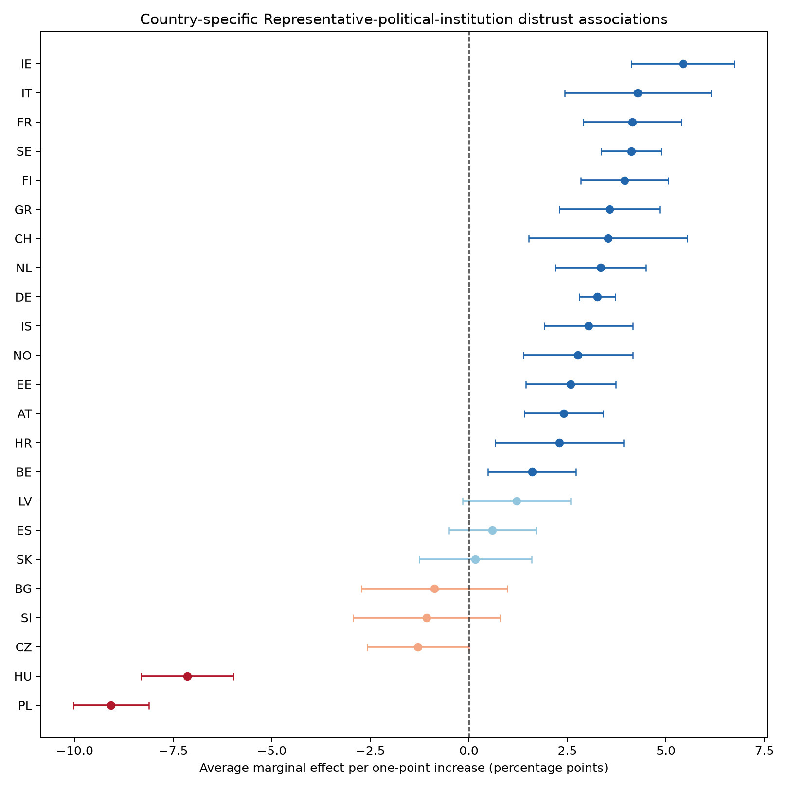
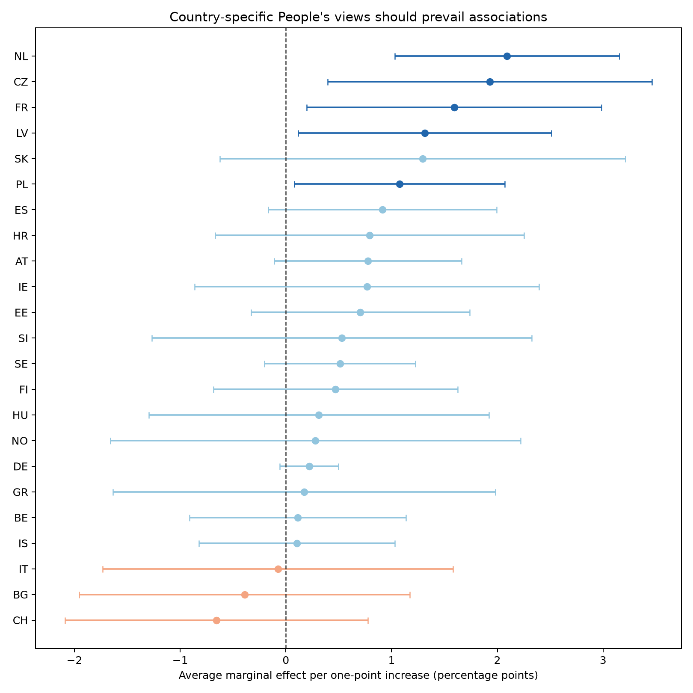
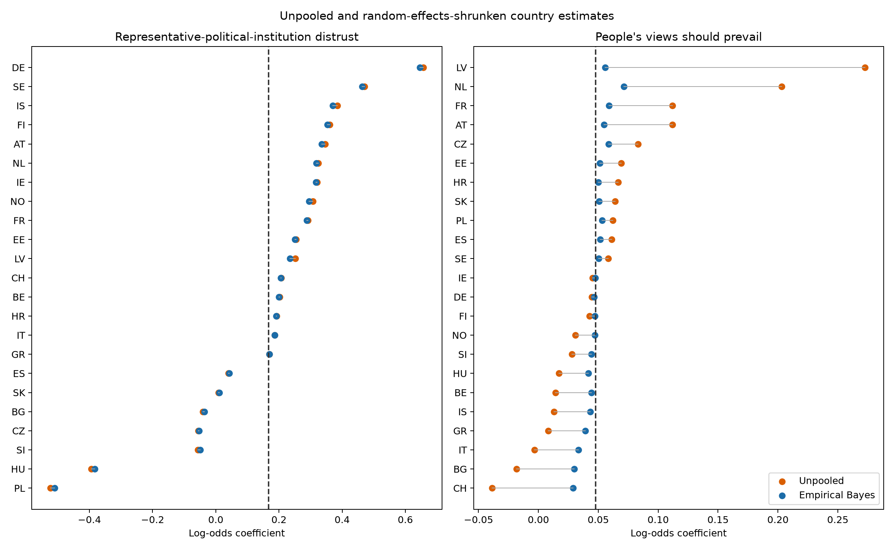

# Stage 9A exploratory country heterogeneity

This post-result extension estimates the same weighted M2 H1-H2a specification
separately in each of the 23 primary countries. Standard errors are clustered by ESS
PSU within country. Stratum identifiers are complete and audited, but the estimator
does not implement a full stratified Taylor linearization; country intervals are
therefore conditional on this documented approximation.

## Direction and evidence categories

| term_label | evidence_category | countries | share | positive_countries | total_countries | positive_share |
|---|---|---|---|---|---|---|
| Representative-political-institution distrust | negative_interval_below_zero | 2 | 8.7% | 18 | 23 | 78.3% |
| Representative-political-institution distrust | negative_interval_includes_zero | 3 | 13.0% | 18 | 23 | 78.3% |
| Representative-political-institution distrust | positive_interval_above_zero | 15 | 65.2% | 18 | 23 | 78.3% |
| Representative-political-institution distrust | positive_interval_includes_zero | 3 | 13.0% | 18 | 23 | 78.3% |
| People's views should prevail | negative_interval_includes_zero | 3 | 13.0% | 20 | 23 | 87.0% |
| People's views should prevail | positive_interval_above_zero | 5 | 21.7% | 20 | 23 | 87.0% |
| People's views should prevail | positive_interval_includes_zero | 15 | 65.2% | 20 | 23 | 87.0% |

Direction is not equated with precision. A positive estimate whose interval includes
zero is compatible with H1/H2 but is not labelled country-level support. Raw p-values
and Benjamini-Hochberg q-values are provided in the country-effect table.

## Random-effects synthesis

| term_label | k | estimate | conf_low | conf_high | tau2 | i2 | prediction_low | prediction_high |
|---|---|---|---|---|---|---|---|---|
| Representative-political-institution distrust | 23.0 | 0.167 | 0.041 | 0.293 | 0.081 | 0.973 | -0.436 | 0.771 |
| People's views should prevail | 23.0 | 0.048 | 0.025 | 0.07 | 0.001 | 0.203 | -0.004 | 0.1 |

For representative-political-institution distrust, the random-effects mean is
0.167, while the prediction interval is -0.436 to
0.771. For `viepol`, the mean is 0.048 and the
prediction interval is -0.004 to 0.100.
Prediction intervals crossing zero indicate that a new comparable country may plausibly
have an association in either direction even when the mean is positive.

The empirical-Bayes display is secondary: it shows how noisy estimates move toward
the random-effects mean but does not hide the unpooled counter-patterns.

## Model and design diagnostics

All country models converged. 7 countries have extreme fitted
probabilities or another registered diagnostic flag. Exact model diagnostics are in
`outputs/tables/stage9_country_model_diagnostics.csv`; PSU and stratum diagnostics are
in `outputs/tables/stage9_design_audit.csv`. PSU counts range from
179 to 1737.

## Interpretation

These analyses answer whether country slopes vary, not whether 23 new confirmatory
hypotheses pass separate significance tests. The random-effects mean, prediction
interval, effect directions, FDR values, and sample sizes must be read together. The
accepted Stage 6 common-slope result remains primary.
