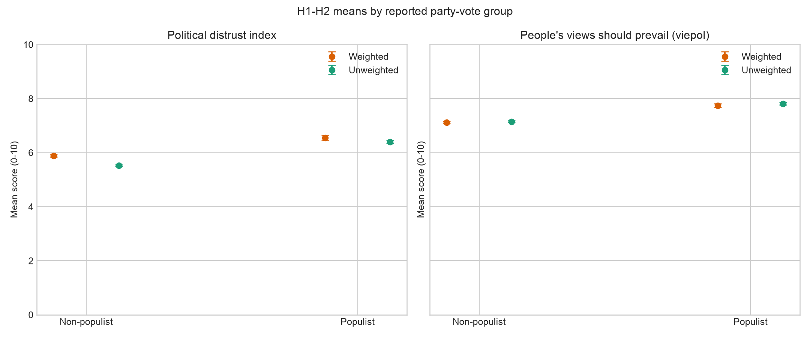
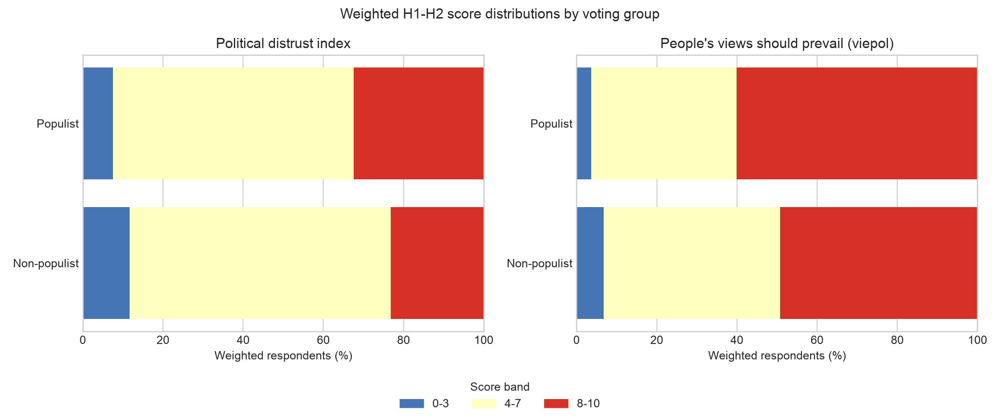
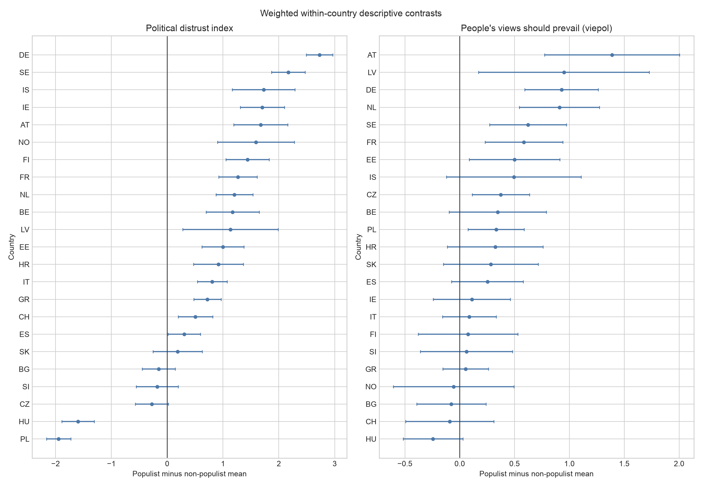
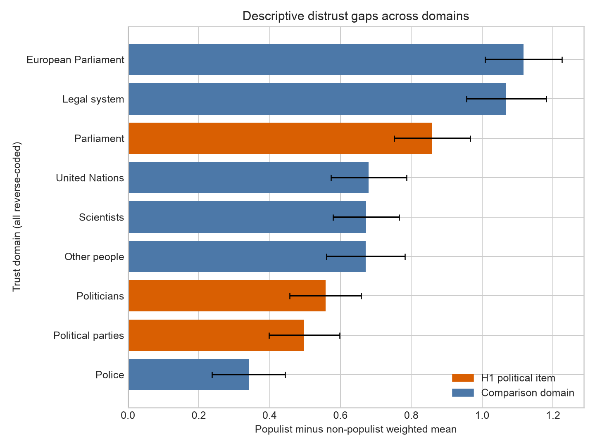

# Stage 5 descriptive H1-H2 comparisons

This report describes the accepted common H2 model sample: **28,089 classifiable
voters in 23 countries**. It contains no regression model and does not establish
independent, adjusted, or causal associations.

The project owner accepted all Stage 5 outputs and interpretations on 2026-09-08;
they remain explicitly available for re-verification in a later session.

## Pooled group summaries

| measure_label | weighting | voting_group | n | effective_n | mean | sd | ci_low | ci_high |
|---|---|---|---|---|---|---|---|---|
| Political distrust index | weighted | Non-populist-party voters | 21208 | 10784.144 | 5.884 | 2.264 | 5.841 | 5.927 |
| Political distrust index | weighted | Populist-party voters | 6881 | 3199.324 | 6.549 | 2.27 | 6.47 | 6.628 |
| Political distrust index | unweighted | Non-populist-party voters | 21208 | 21208.0 | 5.526 | 2.244 | 5.495 | 5.556 |
| Political distrust index | unweighted | Populist-party voters | 6881 | 6881.0 | 6.392 | 2.344 | 6.337 | 6.447 |
| People's views should prevail (viepol) | weighted | Non-populist-party voters | 21208 | 10784.144 | 7.115 | 2.336 | 7.071 | 7.159 |
| People's views should prevail (viepol) | weighted | Populist-party voters | 6881 | 3199.324 | 7.742 | 2.132 | 7.668 | 7.816 |
| People's views should prevail (viepol) | unweighted | Non-populist-party voters | 21208 | 21208.0 | 7.15 | 2.356 | 7.118 | 7.182 |
| People's views should prevail (viepol) | unweighted | Populist-party voters | 6881 | 6881.0 | 7.816 | 2.108 | 7.766 | 7.866 |

Approximate 95% intervals are mean ± 1.96 standard errors. Weighted standard errors
use the Kish effective sample size; they do not yet incorporate the full complex
survey design or the country-fixed-effect model. They are descriptive guides only.

## Pooled differences

| measure_label | weighting | difference | ci_low | ci_high |
|---|---|---|---|---|
| Political distrust index | weighted | 0.665 | 0.576 | 0.755 |
| Political distrust index | unweighted | 0.866 | 0.803 | 0.93 |
| People's views should prevail (viepol) | weighted | 0.628 | 0.542 | 0.714 |
| People's views should prevail (viepol) | unweighted | 0.666 | 0.607 | 0.725 |

In the weighted pooled comparison, populist-party voters score **0.67
points higher** on political distrust and **0.63 points higher** on
`viepol` than non-populist-party voters. These pooled gaps combine within- and
between-country composition and therefore are not the final H1-H2 estimates.

## Score distributions

The source table reports both weighted and unweighted shares in descriptive bands
0-3, 4-7, and 8-10. These bands are visual summaries, not regression cutoffs.

## Within-country contrasts

| measure_label | weighting | countries | countries_positive_difference | equal_country_mean_difference | median_country_difference | min_country_difference | max_country_difference |
|---|---|---|---|---|---|---|---|
| Political distrust index | weighted | 23 | 18 | 0.787 | 0.998 | -1.945 | 2.727 |
| Political distrust index | unweighted | 23 | 18 | 0.775 | 0.945 | -1.917 | 2.771 |
| People's views should prevail (viepol) | weighted | 23 | 19 | 0.357 | 0.323 | -0.243 | 1.388 |
| People's views should prevail (viepol) | unweighted | 23 | 18 | 0.354 | 0.271 | -0.251 | 1.204 |

The weighted mean difference is positive in **18 of 23 countries**
for distrust and **19 of 23 countries** for `viepol`. Variation in
country gaps is expected and is shown rather than hidden; Stage 6 will estimate the
pre-specified country-adjusted associations.

The raw distrust difference is negative in BG, CZ, HU, PL, SI; the raw `viepol`
difference is negative in BG, CH, HU, NO. Poland and Hungary are especially clear
counter-patterns for distrust. Stage 5 therefore does not support a claim that the
pooled descriptive relationship is uniform across national party systems.

Exact country means, differences, and approximate intervals are in
`outputs/tables/stage5_country_contrasts.csv`.

## Trust-domain specificity

| measure_label | common_n | non_populist_mean | populist_mean | difference | ci_low | ci_high |
|---|---|---|---|---|---|---|
| Parliament | 24896 | 5.109 | 5.969 | 0.859 | 0.752 | 0.967 |
| Politicians | 24896 | 6.407 | 6.964 | 0.557 | 0.456 | 0.659 |
| Political parties | 24896 | 6.369 | 6.867 | 0.498 | 0.398 | 0.597 |
| Legal system | 24896 | 4.337 | 5.405 | 1.068 | 0.956 | 1.18 |
| Police | 24896 | 3.414 | 3.754 | 0.341 | 0.238 | 0.444 |
| European Parliament | 24896 | 5.115 | 6.232 | 1.117 | 1.008 | 1.226 |
| United Nations | 24896 | 4.743 | 5.422 | 0.68 | 0.573 | 0.786 |
| Scientists | 24896 | 2.51 | 3.183 | 0.672 | 0.579 | 0.765 |
| Other people | 24896 | 4.98 | 5.651 | 0.671 | 0.561 | 0.781 |

This comparison uses one common complete-case sample across all nine reverse-coded
trust domains so differences in domain gaps are not caused by changing respondents.
The orange bars are the H1 representative-political items; all other domains remain
exploratory specificity checks outside the index. The gaps for the European
Parliament and legal system are larger than the gaps for politicians or political
parties. The group difference is therefore not unique to the H1 domain, even though
the accepted index remains theoretically focused on representative national politics.

## Interpretation boundary

Stage 5 shows whether the raw descriptive direction is compatible with H1 and H2 and
whether it appears across countries. It does not test whether `viepol` contributes
beyond distrust or whether either association persists after controls. Those are
Stage 6 questions under the already accepted specification.
