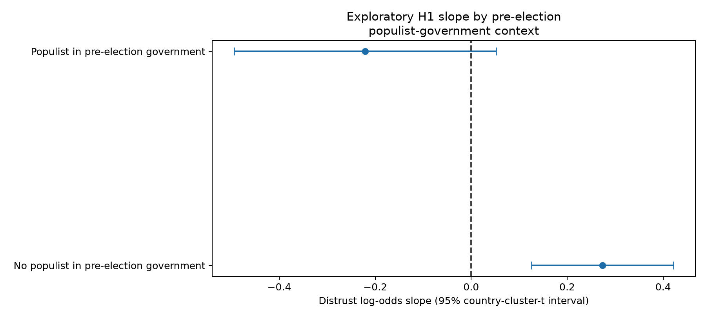
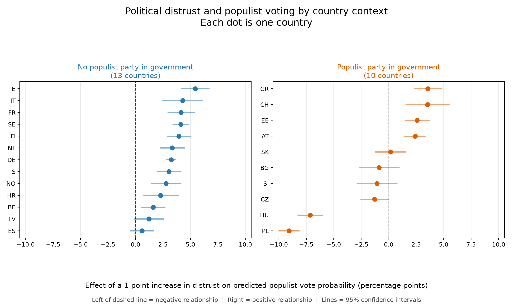
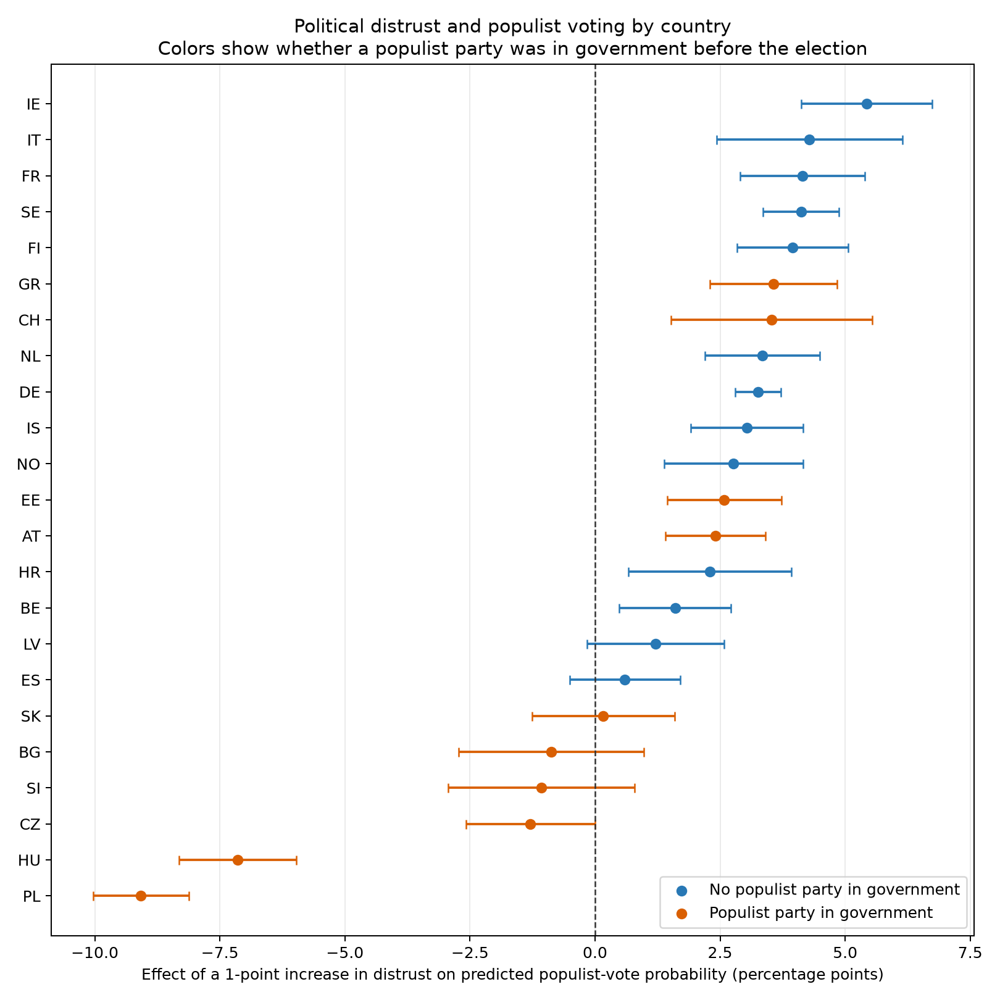

# Stage 9B exploratory government/opposition context

Pre-election cabinet status is derived from [ParlGov 2024](https://doi.org/10.7910/DVN/2VZ5ZC), which covers elections and cabinets through June 2023. PopuList's published ParlGov and Party Facts identifiers provide the party crosswalk; no party-name matching is used. If an election immediately follows a caretaker cabinet, the most recent non-caretaker cabinet supplies partisan incumbent status and the caretaker is retained in the audit table.

## Country context

| cntry | election_date | partisan_cabinet_name | populist_in_pre_election_government | incumbent_populist_parties |
|---|---|---|---|---|
| AT | 2019-09-29 | Kurz I | True | FPO |
| BE | 2019-05-26 | Michel II | False |  |
| BG | 2021-04-04 | Borisov III | True | GERB;NFSB |
| CH | 2019-10-20 | Bundesrat 2015 | True | SVP-UDC |
| CZ | 2017-10-21 | Sobotka | True | ANO |
| DE | 2017-09-24 | Merkel III | False |  |
| EE | 2019-03-03 | Ratas I | True | EK |
| ES | 2019-11-10 | Sanchez I | False |  |
| FI | 2019-04-14 | Sipilae II | False |  |
| FR | 2017-06-18 | Philippe I | False |  |
| GR | 2019-07-07 | Tsipras III | True | SYRIZA |
| HR | 2020-07-05 | Plenkovic II | False |  |
| HU | 2018-04-08 | Orban III | True | Fi-MPSz |
| IE | 2020-02-08 | Varadkar I | False |  |
| IS | 2017-10-28 | Benediktsson B | False |  |
| IT | 2018-03-04 | Gentiloni | False |  |
| LV | 2018-10-06 | Kucinskis I | False |  |
| NL | 2021-03-17 | Rutte V | False |  |
| NO | 2021-09-13 | Solberg V | False |  |
| PL | 2019-10-13 | Morawiecki I | True | PiS |
| SE | 2018-09-09 | Lofven I | False |  |
| SI | 2018-06-03 | Cerar | True | ZL-SD |
| SK | 2020-02-29 | Pellegrini | True | Smer;SNS |

## Context interaction

| context | estimate | std_error | conf_low | conf_high | statistic | p_value | df |
|---|---|---|---|---|---|---|---|
| No populist in pre-election government | 0.274 | 0.071 | 0.126 | 0.422 | 3.835 | 0.001 | 22.0 |
| Populist in pre-election government | -0.221 | 0.132 | -0.494 | 0.052 | -1.676 | 0.108 | 22.0 |

The same comparison below retains every country as a separate point. Values to the
right of zero indicate that greater distrust is associated with a higher predicted
probability of populist voting; values to the left indicate the opposite pattern.

For compact presentation, the following version keeps the original one-country-per-row
forest-plot layout and uses color only for pre-election government context.

The interaction coefficient comparing H1 slopes in contexts with versus without a populist party in the pre-election government is -0.494 (95% interval -0.802 to -0.187, p=0.003). This is an exploratory comparison across only 23 countries and cannot establish that government participation causes the slope difference.

Across leave-one-country-out refits, the interaction ranges from -0.547 to -0.288; 23 of 23 intervals remain entirely below zero. This reveals whether the contextual pattern is concentrated in one country without authorizing post-hoc exclusions.

## Party-level vote type

| vote_type | n | countries | weighted_mean_distrust | weighted_mean_viepol |
|---|---|---|---|---|
| incumbent_populist | 2864 | 8 | 5.984 | 7.812 |
| non_populist | 21208 | 23 | 5.884 | 7.115 |
| opposition_populist | 3942 | 21 | 6.855 | 7.698 |
| unresolved | 75 | 3 | 7.362 | 8.878 |

The identifier crosswalk leaves 4 populist party-response categories unresolved. A three-category multinomial model was not fitted: 15 of the 23 country rows have fewer than 30 incumbent-populist voters, so category-specific estimates would combine structural zeros, sparse cells, and a different unweighted estimator. The auditable vote-type cells are retained for future design work rather than forcing an unstable model.

## Interpretation boundary

The context result is compatible with the idea that generic trust in parliament, politicians, and parties has a different political target when populists govern. It does not directly measure trust in incumbents or “the establishment.” The Stage 6 primary model remains unchanged, and Stage 9B is explicitly post-result and exploratory.
