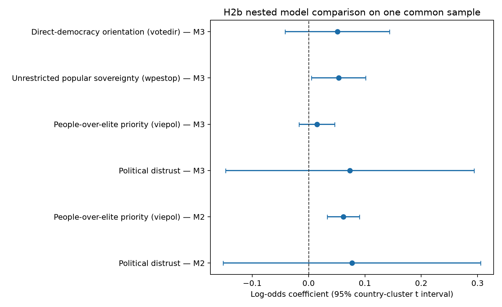
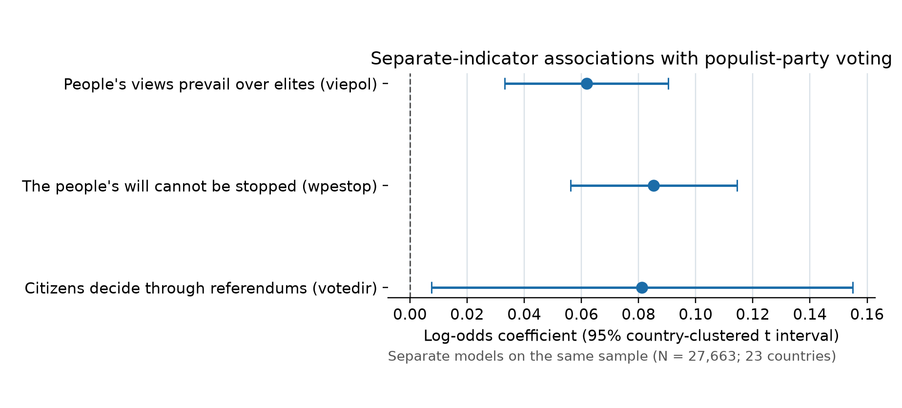

# H2b: additional sovereignty and direct-democracy orientations

## Existing analysis retained

The respondent pipeline uses ESS Round 10 variable-specific codebooks to preserve raw fields and recode only declared special values. Reported voters are linked to the published ESS–Party Facts bridge and PopuList 4.0; the binary outcome is defined only when the selected party can be classified as populist or non-populist. The established primary model uses the complete three-item distrust index (`10 - trstprl`, `10 - trstplt`, `10 - trstprt`), continuous `viepol`, age, gender, education, `anweight`, country fixed intercepts, and country-clustered logistic GEE uncertainty with t-based intervals. Model-specific complete cases are used without imputation. H1 was positive but imprecise (β=0.076, 95% CI −0.150 to 0.303); H2a was positive (β=0.063, 0.036 to 0.090; AME 0.93 percentage points).

## Measurement description

| variable | concept | eligible_n | valid_n | missing_n | missing_share | mean | sd | median | min | max | floor_share_0 | ceiling_share_10 | upper_share_8_10 |
|---|---|---|---|---|---|---|---|---|---|---|---|---|---|
| viepol | People-over-elite priority (viepol) | 29749 | 29000 | 749 | 2.5% | 7.311 | 2.321 | 8.0 | 0.0 | 10.0 | 0.018 | 0.233 | 0.531 |
| wpestop | Unrestricted popular sovereignty (wpestop) | 29749 | 29115 | 634 | 2.1% | 7.837 | 2.089 | 8.0 | 0.0 | 10.0 | 0.007 | 0.3 | 0.63 |
| votedir | Direct-democracy orientation (votedir) | 29749 | 29341 | 408 | 1.4% | 7.825 | 2.265 | 8.0 | 0.0 | 10.0 | 0.012 | 0.324 | 0.645 |

Pairwise correlations and country distributions are supplied as CSV files. They describe overlap and scale use; they are not evidence that the three variables form a homogeneous scale. `viepol` is treated as the bridge item between a people-over-elite reading and the broader People-Centrism literature, while `wpestop` and `votedir` retain their distinct ESS content. No composite, alpha/omega, EFA, or CFA is used.

Country scale use is visibly non-identical: `viepol` country means range from 6.48 (DE) to 8.43 (HR), and score-10 shares from 7.9% (NL) to 47.1% (HR); `wpestop` country means range from 6.96 (NL) to 8.78 (IS), and score-10 shares from 10.6% (NL) to 52.9% (ES); `votedir` country means range from 6.59 (NL) to 8.90 (SI), and score-10 shares from 11.1% (NL) to 57.4% (HR). These contrasts reinforce the need to retain the indicators separately and qualify cross-national comparability.

## Nested comparison

Both models use exactly the same 27,663 voters in 23 countries. The base model retains distrust, `viepol`, demographics, and country effects; the extended model adds `wpestop` and `votedir` separately.

| model | n | countries | parameters | kish_effective_n | weighted_brier | weighted_log_loss |
|---|---|---|---|---|---|---|
| M2 | 27663 | 23 | 33 | 13731.88246 | 0.14913 | 0.45587 |
| M3 | 27663 | 23 | 35 | 13731.88246 | 0.14878 | 0.45436 |

GEE does not supply a conventional full-likelihood AIC for this weighted comparison, so AIC/BIC are not used. The same-sample weighted Brier score and log loss are reported as descriptive fit measures; lower values indicate better in-sample prediction.

| model | term | estimate_log_odds | conf_low | conf_high | p_value | odds_ratio |
|---|---|---|---|---|---|---|
| M2 | Political distrust | 0.0771 | -0.1515 | 0.3057 | 0.4916 | 1.0802 |
| M2 | People-over-elite priority (viepol) | 0.0618 | 0.0332 | 0.0903 | 0.0002 | 1.0637 |
| M3 | Political distrust | 0.0732 | -0.1475 | 0.2939 | 0.4985 | 1.076 |
| M3 | People-over-elite priority (viepol) | 0.0148 | -0.017 | 0.0466 | 0.3452 | 1.0149 |
| M3 | Unrestricted popular sovereignty (wpestop) | 0.0533 | 0.0052 | 0.1015 | 0.0314 | 1.0548 |
| M3 | Direct-democracy orientation (votedir) | 0.0512 | -0.0415 | 0.1439 | 0.2643 | 1.0525 |

The joint cluster-Wald test is F(2, 22)=15.825, p=5.512e-05. This tests the central H2b question that the two added coefficients are jointly zero. In the extended model, the `viepol` coefficient changes by -0.047 log-odds (-76.0% relative to the same-sample base estimate).

The non-preferred one-at-a-time decompositions below are included only to locate the incremental signal, not to select a scale by significance.

| comparison | statistic_f | numerator_df | denominator_df | chi_square | p_value | weighted_brier | weighted_log_loss |
|---|---|---|---|---|---|---|---|
| Add wpestop to M2 | 25.30254 | 1.0 | 22.0 | 25.30254 | 5e-05 | 0.1488 | 0.45493 |
| Add votedir to M2 | 2.50893 | 1.0 | 22.0 | 2.50893 | 0.12747 | 0.14903 | 0.45487 |
| Add wpestop after votedir | 5.28371 | 1.0 | 22.0 | 5.28371 | 0.0314 | 0.14878 | 0.45436 |
| Add votedir after wpestop | 1.31215 | 1.0 | 22.0 | 1.31215 | 0.26431 | 0.14878 | 0.45436 |

## Same-sample single-indicator comparison

Each model below contains political distrust, one H2 indicator, the same demographic controls, and the same country fixed effects. All models use the identical 27,663-person H2b sample. These estimates describe each indicator's overall adjusted association when the other two indicators are omitted; they do not isolate unique contributions or test whether coefficients differ from one another.

| term | estimate_log_odds | conf_low | conf_high | p_value | ame | ame_low | ame_high | weighted_brier | weighted_log_loss |
|---|---|---|---|---|---|---|---|---|---|
| viepol | 0.06178 | 0.03323 | 0.09033 | 0.00018 | 0.91122 | 0.49907 | 1.32338 | 0.14913 | 0.45587 |
| wpestop | 0.08532 | 0.05625 | 0.11439 | 0.0 | 1.25591 | 0.8344 | 1.67742 | 0.14883 | 0.45509 |
| votedir | 0.08122 | 0.00745 | 0.15499 | 0.03244 | 1.19676 | 0.14839 | 2.24512 | 0.14918 | 0.45523 |

For completeness, the within-M3 pairwise coefficient-difference tests are:

| contrast | first | second | estimate_log_odds_difference | std_error | conf_low | conf_high | statistic | p_value | df |
|---|---|---|---|---|---|---|---|---|---|
| wpestop - viepol | wpestop | viepol | 0.03855 | 0.02467 | -0.01262 | 0.08971 | 1.56244 | 0.13246 | 22.0 |
| votedir - viepol | votedir | viepol | 0.03641 | 0.05256 | -0.07258 | 0.1454 | 0.69282 | 0.49567 | 22.0 |
| wpestop - votedir | wpestop | votedir | 0.00213 | 0.06495 | -0.13257 | 0.13684 | 0.03286 | 0.97408 | 22.0 |

## Average marginal effects

| model | term | estimate | conf_low | conf_high | p_value |
|---|---|---|---|---|---|
| M2 | Political distrust | 1.137 | -2.205 | 4.48 | 0.4878 |
| M2 | People-over-elite priority (viepol) | 0.911 | 0.499 | 1.323 | 0.0001 |
| M3 | Political distrust | 1.077 | -2.137 | 4.29 | 0.4945 |
| M3 | People-over-elite priority (viepol) | 0.218 | -0.252 | 0.687 | 0.3472 |
| M3 | Unrestricted popular sovereignty (wpestop) | 0.784 | 0.062 | 1.506 | 0.0346 |
| M3 | Direct-democracy orientation (votedir) | 0.753 | -0.588 | 2.094 | 0.2569 |

The AMEs are average percentage-point changes per one-point increase, not causal effects. Standardizing one score at a time from 5 to 10 changes fitted probability from 24.3% to 25.3% for `viepol`, 22.5% to 26.4% for `wpestop`, and 22.5% to 26.3% for `votedir`, holding the observed distribution of all other covariates fixed.

## Sensitivity checks

| check | label | n | countries | statistic_f | numerator_df | denominator_df | p_value | beta_viepol | beta_wpestop | beta_votedir |
|---|---|---|---|---|---|---|---|---|---|---|
| H2B | M3 extended model | 27663 | 23 | 15.8253 | 2.0 | 22.0 | 0.0001 | 0.0148 | 0.0533 | 0.0512 |
| U | Unweighted | 27663 | 23 | 12.2053 | 2.0 | 22.0 | 0.0003 | 0.0043 | 0.0433 | 0.0585 |
| D2 | Distrust index from 2+ items | 27888 | 23 | 17.3589 | 2.0 | 22.0 | 0.0 | 0.0131 | 0.0554 | 0.0499 |
| MODE | Add categorical survey mode | 27618 | 23 | 14.1393 | 2.0 | 22.0 | 0.0001 | 0.0144 | 0.05 | 0.0495 |
| BORD | Borderline-inclusive classification | 27663 | 23 | 24.5297 | 2.0 | 22.0 | 0.0 | 0.0221 | 0.0486 | 0.0513 |

Leave-one-country-out estimates remain available in the influence table. The least favorable joint-test p-value is 0.0005432 when IT is omitted. The largest absolute coefficient shifts are distrust_index_three: +0.118 omitting PL, viepol: -0.012 omitting PL, wpestop: -0.032 omitting PL, votedir: +0.049 omitting PL. Thus the result can be assessed without selecting countries post hoc.

Country-specific extended-model point estimates are positive in 13/23 countries for `viepol`, 17/23 for `wpestop`, and 18/23 for `votedir`. These directions diagnose heterogeneity and are not separate confirmatory tests.

## Direct answer to H2b

Yes: `wpestop` and `votedir` jointly provide incremental explanatory information beyond `viepol` under the primary model (F(2, 22)=15.83, p=5.512e-05), accompanied by a small improvement in same-sample Brier score and log loss. The `viepol` coefficient falls from 0.062 to 0.015, a 76.0% attenuation, and its interval then includes zero. The incremental signal is mainly `wpestop`: it remains informative after `votedir`, whereas `votedir` is imprecise after `wpestop`. This does not show that either added item has a causal effect, that their coefficients differ statistically from one another, or that a broader scale is more valid. The narrow H2a operationalization should remain the main-paper measure because it directly matches the people-over-elite claim. H2b should be reported transparently as an exploratory qualification: broadening adds predictive association, chiefly around unrestricted popular sovereignty, but makes the construct less specific by mixing representational, constraint-related, and direct-democratic content.

## Reusable manuscript paragraphs

### Chapter 3 — Methods

As an exploratory extension to H2a, we assessed whether unrestricted popular sovereignty (`wpestop`) and direct-democracy orientation (`votedir`) provided information about populist-party voting beyond the people-over-elite priority measured by `viepol`. We retained the three ESS items as separate 0–10 predictors rather than assuming a homogeneous scale. On a common complete-case sample, we compared the primary weighted country-fixed-intercept logistic GEE with an otherwise identical model adding `wpestop` and `votedir`. Uncertainty was clustered by country, 95% intervals used a t distribution based on the number of country clusters, and the incremental contribution was assessed with a two-degree-of-freedom cluster-Wald F test. All estimates are associational.

### Chapter 4 — Findings

On the common H2b sample, the base `viepol` coefficient was 0.062 (95% CI 0.033 to 0.090); after adding the two distinct orientations it was 0.015 (-0.017 to 0.047). In the extended model, `wpestop` was 0.053 (0.005 to 0.101) and `votedir` was 0.051 (-0.042 to 0.144). Their joint test was F(2, 22)=15.83, p=5.512e-05. These results describe incremental explanatory association rather than causal effects.

### Chapter 5 — Conceptual interpretation

The exploratory extension distinguishes statistical gain from conceptual validity. `viepol` directly captures a people-over-elite representational priority and also serves as a bridge to broader People-Centrism accounts; `wpestop` concerns popular sovereignty unconstrained by institutional limits, whereas `votedir` concerns direct-democratic decision making. Adding the latter items may improve explanation of party choice, but it also broadens the construct and makes a single “people-centred” label less specific. We therefore retain the narrow H2a measure for the main claim and present H2b as evidence about related but distinguishable orientations, not as validation of a superior composite scale.
