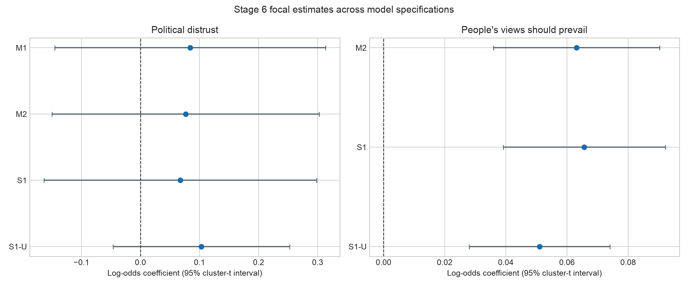
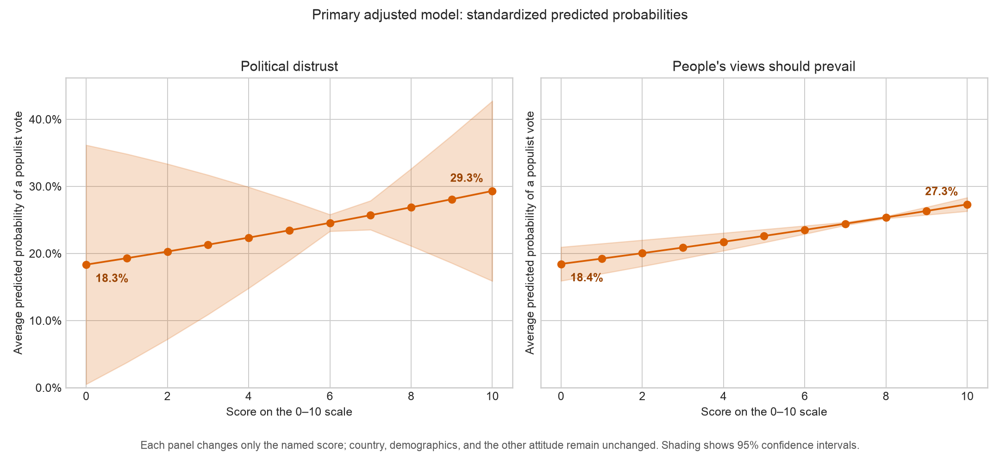
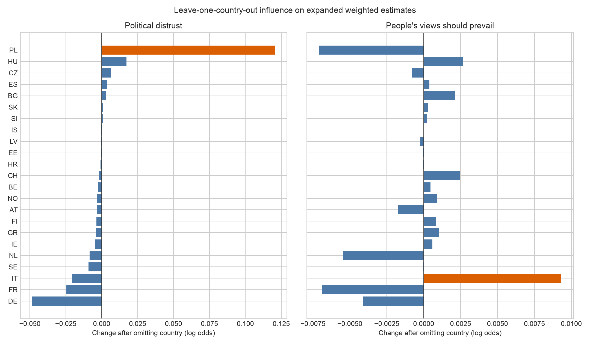

# Stage 6 main H1-H2a models

This report fits the accepted country-fixed-intercept logistic sequence among
classifiable voters. Primary estimates use the ESS analysis weight. Estimating
equations are clustered by country with an independent working correlation, and
reported 95% intervals use a t reference distribution with 22 degrees of freedom
because only 23 country clusters are available.

The project owner authorized automatic acceptance of interpretations; every Stage 6
interpretation is recorded as re-verifiable in a later session.

## Model sequence and samples

| model | model_label | weighting | n | populist_voters | non_populist_voters | countries | kish_effective_n |
|---|---|---|---|---|---|---|---|
| M1 | H1 adjusted | anweight | 28657 | 7002 | 21655 | 23 | 14216 |
| M2 | H2a adjusted | anweight | 28089 | 6881 | 21208 | 23 | 13950 |
| S1 | Expanded: + political interest | anweight | 28040 | 6865 | 21175 | 23 | 13923 |
| S1-U | Expanded unweighted | unweighted | 28040 | 6865 | 21175 | 23 | 28040 |

M1 is the adjusted H1 model with political distrust, age, gender, education, and
country indicators. M2 is the adjusted H2a model and adds `viepol` to M1. S1 adds
political interest as a sensitivity check; S1-U repeats S1 without weights. Complete
cases are selected separately for the variables in each model.

## Focal coefficients

| model | term | estimate_log_odds | std_error | conf_low | conf_high | p_value | odds_ratio |
|---|---|---|---|---|---|---|---|
| M1 | Political distrust | 0.084 | 0.111 | -0.145 | 0.314 | 0.454 | 1.088 |
| M2 | Political distrust | 0.076 | 0.109 | -0.150 | 0.303 | 0.491 | 1.079 |
| M2 | People's views should prevail | 0.063 | 0.013 | 0.036 | 0.090 | 0.000 | 1.065 |
| S1 | Political distrust | 0.067 | 0.111 | -0.164 | 0.299 | 0.551 | 1.070 |
| S1 | People's views should prevail | 0.066 | 0.013 | 0.039 | 0.092 | 0.000 | 1.068 |
| S1-U | Political distrust | 0.103 | 0.072 | -0.047 | 0.252 | 0.167 | 1.108 |
| S1-U | People's views should prevail | 0.051 | 0.011 | 0.028 | 0.074 | 0.000 | 1.052 |

In the primary adjusted model, the political-distrust coefficient is
**0.076** (95% cluster-t
interval -0.150 to
0.303). Its interval
includes zero. The `viepol` coefficient is
**0.063** (95% interval
0.036 to 0.090)
and excludes zero.

Accordingly, Stage 6 does not provide precise country-clustered support for H1 in its common positive-association form. It supports H2 as an association of `viepol` with populist-party voting after accounting for political distrust, country, and demographics. These remain associational, not causal, results.

Adding political interest in S1 leaves the substantive conclusion unchanged: the
distrust interval still includes zero, while the `viepol` interval excludes zero.

## Average marginal effects and probabilities

| model | term_label | estimate | conf_low | conf_high | p_value |
|---|---|---|---|---|---|
| M1 | Political distrust | 1.25 pp | -2.11 pp | 4.60 pp | 0.449 |
| M2 | Political distrust | 1.13 pp | -2.19 pp | 4.45 pp | 0.488 |
| M2 | People's views should prevail | 0.93 pp | 0.54 pp | 1.33 pp | 0.000 |
| S1 | Political distrust | 0.99 pp | -2.39 pp | 4.38 pp | 0.549 |
| S1 | People's views should prevail | 0.97 pp | 0.59 pp | 1.35 pp | 0.000 |
| S1-U | Political distrust | 1.41 pp | -0.60 pp | 3.42 pp | 0.159 |
| S1-U | People's views should prevail | 0.70 pp | 0.39 pp | 1.01 pp | 0.000 |

One point higher political distrust corresponds to an average probability change of
**1.13 percentage points** in M2;
one point higher `viepol` corresponds to **0.93
percentage points**. These are averages over the observed covariate distribution.

Standardizing every M2 observation first to score 0 and then to score 10 changes the
average predicted probability from 18.3% to
29.3% for political distrust, and from
18.4% to 27.3% for `viepol`.
The endpoints illustrate the fitted curve and should not be read as effects of an
intervention or as comparisons among otherwise identical real respondents.

## Convergence and separation checks

| model | converged | iterations | predicted_min | predicted_p01 | predicted_p99 | predicted_max | predicted_below_001 | predicted_above_999 |
|---|---|---|---|---|---|---|---|---|
| M1 | True | 2 | 0.0112 | 0.0196 | 0.7986 | 0.8982 | 0 | 0 |
| M2 | True | 2 | 0.0094 | 0.0184 | 0.8004 | 0.9068 | 0 | 0 |
| S1 | True | 2 | 0.0092 | 0.0190 | 0.8078 | 0.9006 | 0 | 0 |
| S1-U | True | 2 | 0.0095 | 0.0184 | 0.8107 | 0.9038 | 0 | 0 |

All four models converged. No fitted observation has a probability below .001 or
above .999, and no focal estimate is numerically extreme. The pre-specified country
screen is applied before covariate complete-case restrictions; LV falls below 30 in one final complete-case outcome cell and is retained under that accepted ordering. Exact cells are in `outputs/tables/stage6_country_cells.csv`.

## Influential-country check

| term_label | omitted_country | leave_one_out_estimate_log_odds | change_log_odds |
|---|---|---|---|
| Political distrust | PL | 0.197 | 0.12 |
| Political distrust | DE | 0.028 | -0.048 |
| Political distrust | FR | 0.052 | -0.025 |
| People's views should prevail | IT | 0.072 | 0.009 |
| People's views should prevail | PL | 0.056 | -0.007 |
| People's views should prevail | FR | 0.056 | -0.007 |

The largest leave-one-country-out coefficient change is
+0.120 for distrust when
omitting PL, and
+0.009 for `viepol` when omitting
IT. This check diagnoses sensitivity to
country composition; it does not introduce country-specific hypotheses or select a
preferred country subset.

## Interpretation boundary

Odds ratios, marginal effects, and standardized probabilities describe the same
logistic models on different scales. Country fixed effects absorb stable country
differences, but they do not remove unmeasured respondent-level confounding, outcome
misclassification, party-response nonresponse, or cross-national measurement
non-equivalence. Stage 7 will apply the registered robustness checks rather than
silently changing this primary specification.
