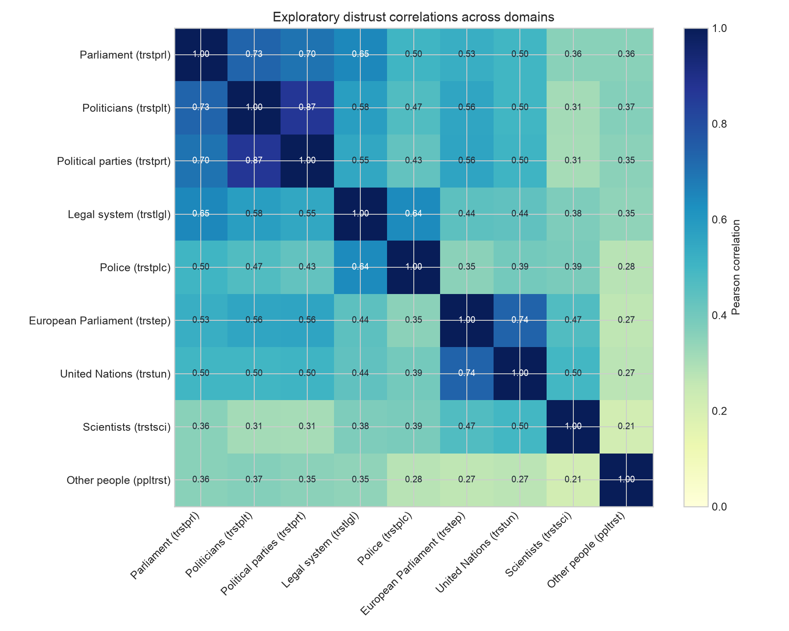
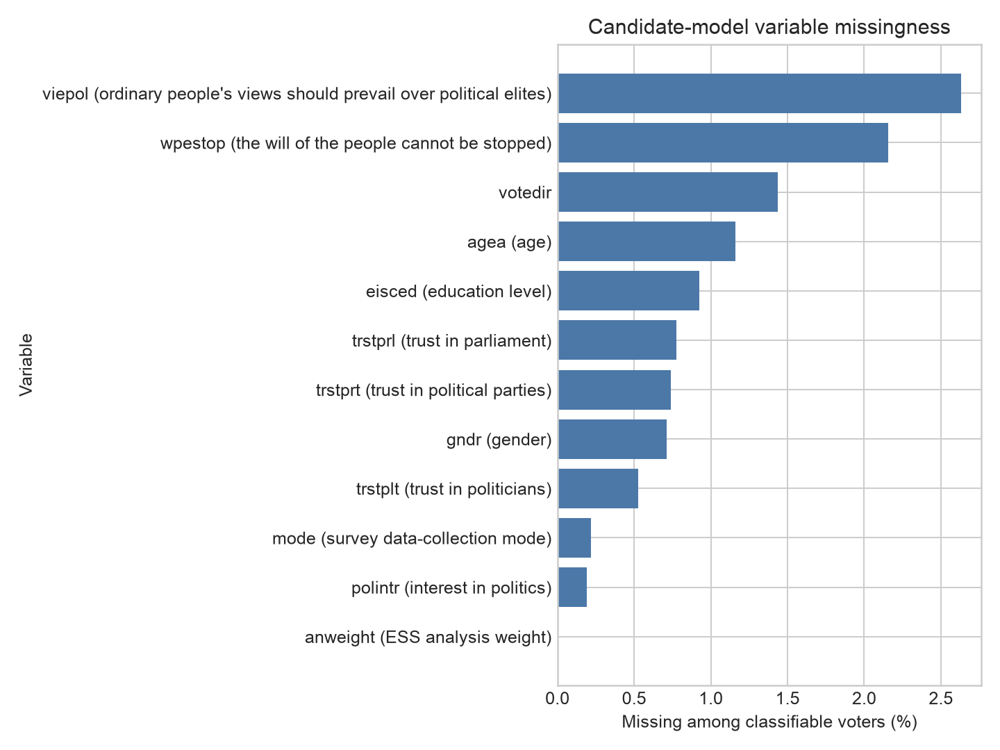
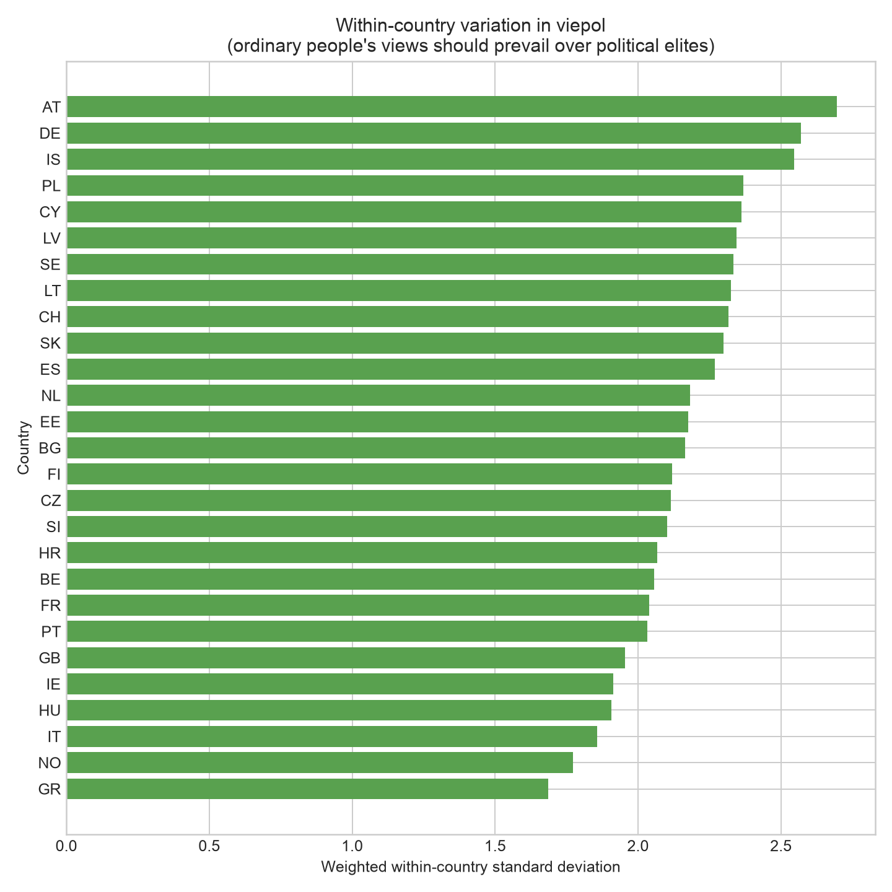
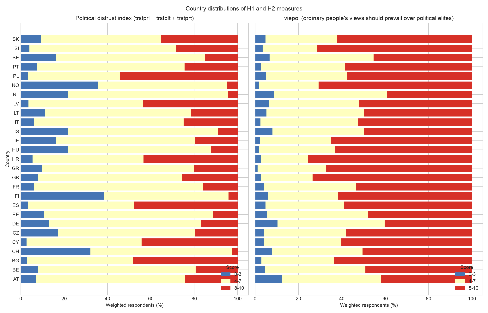
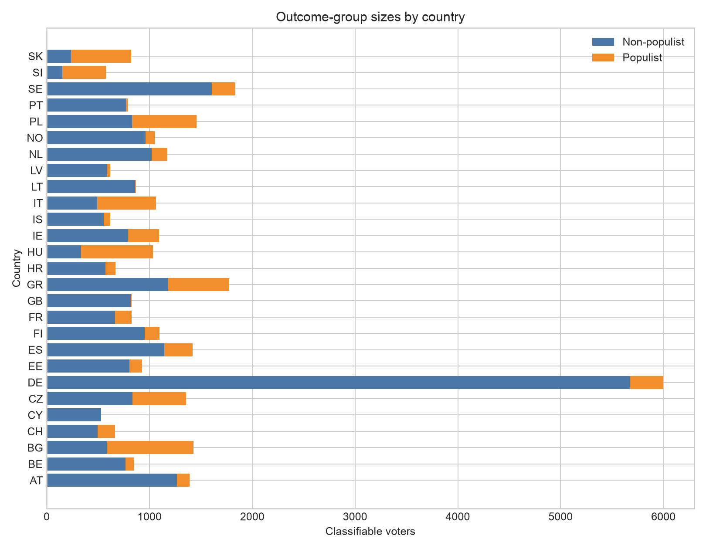

# Stage 4 measurement and sample diagnostics

This report reproduces decision evidence from canonical Table C. All registered
Stage 4 items and interpretations were accepted by the project owner on 2026-09-08.

## Political-distrust measurement

| measure | items | complete_n | cronbach_alpha |
|---|---|---|---|
| Political distrust (3 items) | Trust in parliament (trstprl); Trust in politicians (trstplt); Trust in political parties (trstprt) | 32297 | 0.905 |

| item | complete_n | corrected_item_total_correlation | alpha_if_item_deleted |
|---|---|---|---|
| distrust_prl | 32297 | 0.741 | 0.928 |
| distrust_plt | 32297 | 0.864 | 0.82 |
| distrust_prt | 32297 | 0.837 | 0.844 |

| item | observed_n | missing_n | missing_share | mean | sd | weighted_mean | share_0 | share_10 |
|---|---|---|---|---|---|---|---|---|
| distrust_prl | 32506 | 254 | 0.008 | 5.069 | 2.653 | 5.363 | 0.029 | 0.083 |
| distrust_plt | 32587 | 173 | 0.005 | 6.176 | 2.461 | 6.461 | 0.007 | 0.136 |
| distrust_prt | 32518 | 242 | 0.007 | 6.183 | 2.402 | 6.443 | 0.007 | 0.125 |

The three source items are reverse-coded from their original 0-10 trust scales, so
higher values indicate greater distrust. Cronbach's alpha summarizes the internal
consistency of the proposed three-item composite; it is not evidence of inter-rater
agreement or, by itself, proof that the scale is unidimensional. Corrected item-total
correlations use complete rows and correlate each item with the sum of the other two.
The exact score distributions are in
`outputs/tables/stage4_item_distributions.csv`.

### Pairwise correlations with H2 indicators

| variable | distrust_prl | distrust_plt | distrust_prt | viepol | wpestop |
|---|---|---|---|---|---|
| distrust_prl | 1.0 | 0.732 | 0.698 | 0.13 | 0.076 |
| distrust_plt | 0.732 | 1.0 | 0.866 | 0.113 | 0.08 |
| distrust_prt | 0.698 | 0.866 | 1.0 | 0.098 | 0.069 |
| viepol | 0.13 | 0.113 | 0.098 | 1.0 | 0.54 |
| wpestop | 0.076 | 0.08 | 0.069 | 0.54 | 1.0 |

## One-dimensionality check

| component | eigenvalue | variance_share | loading_distrust_prl | loading_distrust_plt | loading_distrust_prt |
|---|---|---|---|---|---|
| PC1 | 2.534 | 0.845 | 0.877 | 0.946 | 0.933 |
| PC2 | 0.334 | 0.111 | -0.48 | 0.182 | 0.266 |
| PC3 | 0.132 | 0.044 | 0.032 | -0.268 | 0.242 |

The PCA uses the complete-case item correlation matrix. A dominant first component,
positive first-component loadings, and remaining eigenvalues below one support a
concise one-dimensional summary. This is a diagnostic, not a substitute for the
construct argument.

## Proportionate country-level reliability check

| countries | min_alpha | q1_alpha | median_alpha | q3_alpha | max_alpha | countries_alpha_ge_0_70 |
|---|---|---|---|---|---|---|
| 27 | 0.841 | 0.868 | 0.891 | 0.902 | 0.925 | 27 |

The full country table is `outputs/tables/stage4_country_reliability.csv`. It is
reported as a compact heterogeneity check rather than as 27 separate scale-selection
tests.

| rule | n | weighted_mean |
|---|---|---|
| All three items | 32297 | 6.09 |
| At least two items | 32630 | 6.09 |

## Appendix: trust-domain specificity

All trust items are reverse-coded only to give them a common direction: higher values
mean greater distrust. The legal system, police, supranational institutions,
scientists, and other people are exploratory comparison domains; they are not added
to the primary political-distrust index. The appendix asks whether parliament,
politicians, and political parties correlate more strongly with one another than with
the comparison domains.

The exact matrix is available in `outputs/tables/stage4_domain_correlations.csv`.

## Candidate model-sample flow

| stage | retained | dropped_at_stage | retained_share_of_outcome_sample |
|---|---|---|---|
| Classifiable outcome | 32760 | 0 | 100.0% |
| Distrust index: all 3 items | 32297 | 463 | 98.6% |
| Plus viepol | 31526 | 771 | 96.2% |
| Plus positive anweight | 31526 | 0 | 96.2% |
| Plus all provisional controls | 30935 | 591 | 94.4% |

## Fully specified candidate model samples

| sample | retained | dropped_from_outcome_sample | retained_share | countries |
|---|---|---|---|---|
| H1 primary: distrust + primary controls | 28657 | 4103 | 87.5% | 23 |
| H2 primary: H1 + viepol + primary controls | 28089 | 4671 | 85.7% | 23 |
| H2 expanded: primary + polintr | 28040 | 4720 | 85.6% | 23 |
| H2 mode sensitivity: expanded + mode | 27995 | 4765 | 85.5% | 23 |

The primary H1 and H2 samples use model-specific complete cases. The loss remains
small enough that no imputation or attrition model is added. H2 requires the H1 index
because it tests whether `viepol` contributes beyond political distrust.

The accepted 30-per-outcome stability screen is applied to the classifiable outcome
sample before covariate missingness. After complete-case filtering, the following H2
country falls just below 30 and is retained under that pre-specified ordering:

| cntry | classifiable | populist | non_populist |
|---|---|---|---|
| LV | 566 | 29.0 | 537.0 |

The project owner accepted retaining Latvia under this pre-specified ordering rather
than silently changing the country list after covariate filtering.

## H2 within-country variation

| variable | observed_n | weighted_mean | weighted_sd | weighted_share_8_10 | weighted_share_10 |
|---|---|---|---|---|---|
| viepol | 31898 | 7.447 | 2.29 | 0.553 | 0.261 |
| wpestop | 32053 | 7.761 | 2.135 | 0.61 | 0.3 |

The pooled weighted results reproduce the exploratory pattern: `viepol` retains
variation but is concentrated at 8-10, while `wpestop` has the stronger ceiling.

Flags use pre-specified descriptive thresholds: weighted SD below 1.75,
weighted share at 8-10 of at least 75%, or share at 10
of at least 50%. They prompt interpretation and do not exclude
a country.

| cntry | n | weighted_mean | weighted_sd | weighted_share_8_10 | weighted_share_10 | weak_sd_flag | severe_ceiling_flag |
|---|---|---|---|---|---|---|---|
| GR | 1747 | 8.019 | 1.685 | 0.674 | 0.221 | True | False |
| HR | 664 | 8.421 | 2.068 | 0.756 | 0.47 | False | True |

## Country distributions of the H1 and H2 measures

The figure reports weighted shares in three descriptive score bands. For the H1 index,
8-10 means high political distrust. For `viepol`, 8-10 means strong support for
ordinary people's views prevailing over political elites. These bands make the
distributions readable; they are not cutoffs used in the regression models. The
underlying models retain the original scores.

Exact weighted shares are available in
`outputs/tables/stage4_country_distributions.csv`. Standard deviations remain in the
technical country-variation table because they answer whether enough within-country
variation exists for modelling.

## Country outcome cells

| cntry | classifiable | populist | non_populist | flag_under_30 |
|---|---|---|---|---|
| CY | 529 | 0.0 | 529.0 | True |
| GB | 825 | 7.0 | 818.0 | True |
| LT | 868 | 10.0 | 858.0 | True |
| PT | 789 | 20.0 | 769.0 | True |

## Weight diagnostics

| weight | observed_n | positive_n | min | median | mean | max | kish_effective_n |
|---|---|---|---|---|---|---|---|
| anweight | 32760 | 32760 | 0.008 | 0.45 | 0.74 | 19.177 | 11288.621 |

ESS recommends `anweight` for all analyses. It combines post-stratification and
population-size weighting and is therefore the primary weight. The sole weight
sensitivity repeats the final model without weights; no menu of alternative weights
is planned. Source: [ESS weighting guidance](https://www.europeansocialsurvey.org/methodology/ess-methodology/data-processing-and-archiving/weighting).

## Model specification handed to Stage 5-6

| component | primary_rule | sensitivity_rule |
|---|---|---|
| Country adjustment | Country fixed intercepts; DE reference | Re-include CY, GB, LT, and PT once |
| Weight | ESS anweight | Repeat the final specification once unweighted |
| Age | (agea - 50) / 10, linear | No polynomial unless diagnostics show failure |
| Gender | Categorical gndr; code 1 (male) reference | None; report source-variable limitation |
| Education | Categorical eisced 1-7; code 4 reference; 55 missing | None |
| Political interest | Excluded from primary control set | Expanded model: categorical polintr; code 4 reference |
| Survey mode | Descriptive only | One categorical adjustment; code 1 CAPI reference |
| Missing data | Model-specific complete cases | No imputation; report each model sample |

Country adjustment is one logistic-regression specification with country fixed
intercepts, not an estimator tournament. Survey mode is descriptive in the main
analysis because collection-mode families are strongly tied to country in Round 10;
one categorical-adjustment sensitivity checks residual within-country mode imbalance.
No H3 or interaction is introduced.

### Survey-mode description

| mode_label | n | populist_share |
|---|---|---|
| CAPI face-to-face | 18079 | 0.3 |
| CAWI self-completion | 8140 | 0.093 |
| paper self-completion | 5051 | 0.167 |
| web-video interview | 1419 | 0.163 |
|  | 71 | 0.155 |

These are unadjusted composition statistics and must not be interpreted as mode
effects because country and collection-mode family are strongly confounded.

## Decision register

| Decision | Outcome | Reviewer status |
|---|---|---|
| Distrust completeness | All three items required | Accepted by owner |
| Primary H2 indicator | viepol alone | Accepted by owner |
| wpestop role | Separate Stage 7 sensitivity indicator | Accepted by owner |
| Missing data | Model-specific complete cases; no imputation | Accepted by owner |
| Country treatment | Fixed intercepts; >=30 per outcome group | Accepted by owner; Latvia retained |
| Primary weight | anweight; one unweighted comparison | Accepted by owner |
| Controls | Primary agea + gndr + eisced; expanded adds polintr | Accepted by owner |
| Survey mode | Descriptive; one categorical-adjustment sensitivity | Accepted by owner |

The script never changes owner-review fields. The corresponding confirmations are
recorded separately in `plans/review-ledger.csv` and the accepted analytical choices
are retained in `docs/methods_decision_log.md`.
